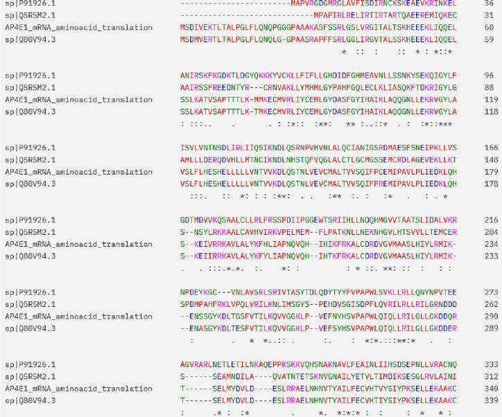

# Bioinformatics - Analyzing AP4E1 gene mutation
 
### Introduction

AP4E1 encodes a member of adaptor complexes large subunit protein family. These proteins `play important roles in the secretory and endocytic pathways by mediating vesicle formation and sorting of integral membrane proteins`.
Mutations in this gene may lead to:
- SPASTIC PARAPLEGIA 51, AUTOSOMAL RECESSIVE
- STUTTERING, FAMILIAL PERSISTENT, 1

Throughout this text, we'll discuss the second type of mutation, also known as `STUT1`

### Tools

- Perl
- BioPerl
- BLAST+
- SwissProt
- EMBOSS w/ prosite.dat file

---

## Part 1 - Genbank and Amino Acid read frames

The messenger RNA of the AP4E1 was obtained from NCBI. 'NM_007347.5' amino acid transcription was chosen due to its isoform 1
With this nucleotide sequence formatted as a GenBank file, we read all its frames.
Comparing each frame output with an ORF Finder online tool, we found the correct frame among the six generated frames- direct frame 0.

>'AUG' was used as the start codon and 'UAA', 'UAG', and 'UGA' as stop codons

---

## Part 2 - Local & Online BLAST run

The BLAST is run both locally and remotely, using the databases generated by SwissProt.
Both scripts (local and remote BLAST), along with the chosen amino acid and the results from both BLASTs, can be found at its respective folder.
The results obtained from the local BLAST, especially those from the first reading frame, were very similar to the results from the BLAST run on NCBI using the same input FASTA file.

---

## Part 3 - Multiple Sequence Alignment

Related sequences to the Blast results were chosen based on the correct frame discussed in part 1. These related sequences are:

| SPECIE | ACCESSION | HITS |
|----------|----------|----------|
| Homo Sapiens | Q9UPM8.2 | 100% |
| Mus Musculus  | Q80V94.3  |  80.40% |
| Pongo abelii | Q5R5M2.1 | 24.75% |
| Drosophila melanogaster | P91926.1 | 24.75% |

Having these sequences, we can align and compare them. Although the MSA is in its respective folder, some images generated by an online MSA tool are shown due to a visual ease issue.

If we look closer at the percentile relation shown in the previous table, we can see that AP4E1 mutations have a larger distance than Q80V94.3, which is the mouse sequence.
A phylogenetic tree - a diagram that represents evolutionary relationships among organisms - is shown below.

---

## Part 4 - BLAST report from Specie Pattern

As was seen in parts 2 & 3, `Mus Musculus` was a sequence with a high percentage of AA HITS. For this reason, a further look was done to look up similarities.
The results are the following:

| ACCESSION | GEN | REFS | ACC Version | HITS |
|----------|----------|----------|----------|----------|
| Q80V94 | AP4E1_MOUSE | NP_780759.2 NM_175550.3 | Q80V94.3 | 915/1138 (80%) |
| O88512  | AP1G2_MOUSE  |  NP_031481.2 NM_007455.5 | O88512.2 | 158/589 (27%) |
| O54774 | AP3D1_MOUSE | NP_031486.1 NM_007460.1 | O54774.1 | 131/511 (26%) |
|Q9JIF7 | COPB_MOUSE | NP_203534.1 NM_033370.3 | Q9JIF7.1 | 98/426 (23%) |

---

## Part 5 - EMBOSS

#### 5.1 - ORFs
Using the same sequence of nucleotides, we found all its 404 ORFs. These ORFs were found with no codon start restriction and in all directions.

#### 5.2 - Domains from PROSITE DB
Using the `prosite.dat` file and `patmatmotifs` tool, an EMBOSS was run to find to find functional domains.

---

## Related reports

### AP4E1 variants in a Cameroon family Subpedigree E
This image shows how the mutation (black box) was inherited in different members of a family from Cameroon and where the mutation takes place.

### Related genes
More genes have an incidence in disfluency development, some of them are:
- GNPTAB
- GNPTG
- NAGPA

Mutation on these genes can lead to neurological process disfunctions related with speaking.

Studies with mice showed that those who had mutations in the GNPTAB gene made prolonged pauses between syllables related to a mouse that didn't have mutations in that same gene.

---

## Resources

- [https://omim.org/entry/607244](https://omim.org/entry/607244)
- [https://www.ncbi.nlm.nih.gov/pmc/articles/PMC4667129/](https://www.ncbi.nlm.nih.gov/pmc/articles/PMC4667129/)
- [https://knowablemagazine.org/content/article/mind/2020/new-neuroscience-stuttering](https://knowablemagazine.org/content/article/mind/2020/new-neuroscience-stuttering)
- [https://www.agenciasinc.es/Noticias/Descubren-los-primeros-genes-de-la-tartamudez](https://www.agenciasinc.es/Noticias/Descubren-los-primeros-genes-de-la-tartamudez)
- [https://www.bbc.com/mundo/ciencia_tecnologia/2010/02/100211_tartamudez_genes_men](https://www.bbc.com/mundo/ciencia_tecnologia/2010/02/100211_tartamudez_genes_men)
- [https://www.uniprot.org/](https://www.uniprot.org/)
- [https://prosite.expasy.org/mydomains/](https://prosite.expasy.org/mydomains/)
